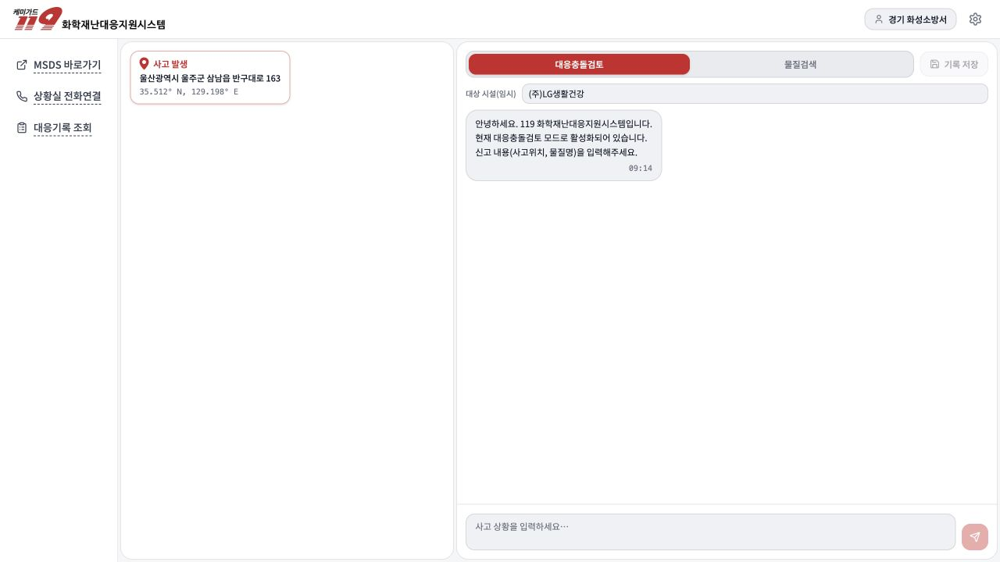
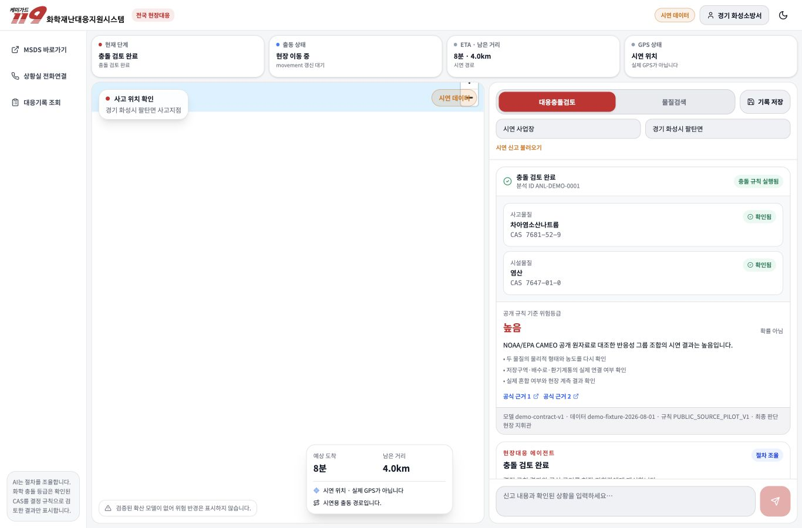
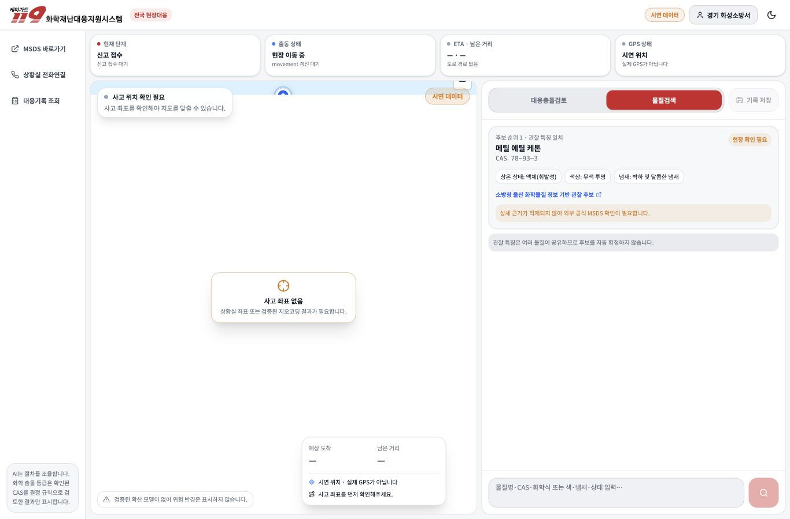
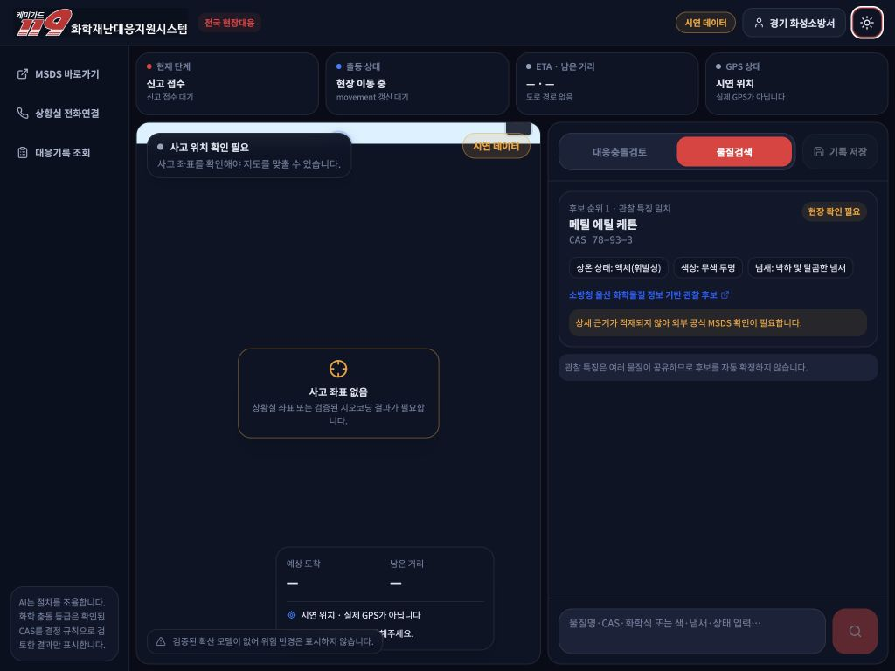

# 프론트엔드 검증 기록

검증일: 2026-08-01

환경: macOS arm64, Node.js 24, Chromium 기반 Codex 브라우저

## 자동 검증

```text
pnpm typecheck  성공
pnpm contract:check 성공 — BE 9685a8c2, 7 operations, generated types synchronized
pnpm test       성공 — 20 files, 78 tests
pnpm build      성공
pnpm build:demo 성공
pnpm build:staging 성공
```

테스트한 핵심 상태:

- GPS 권한 거부·오래된 위치·낮은 정확도
- 실제/시연 GeoJSON 경로만 렌더링
- 에이전트 `EN_ROUTE_TRIAGE` 단계와 다음 행동
- 한 CAS 확인 시 위험 숨김
- 두 CAS 확인·규칙 실행 뒤 위험 표시
- 사고·시설·충돌검토 3단계 체크포인트와 `0/2→2/2` 진행 상태
- 역할별 확인 근거 기본값과 현지 확인 시각의 ISO 변환
- 응답 최상위 `riskDisplayAllowed=false`이면 하위 결과가 완료돼도 위험 숨김
- RAG 문장 `sourceIds`와 일치하는 citation만 연결
- 검색 후보를 자동 확정하지 않고 기존 사고의 확인 창으로 전달
- 저장 성공 응답에서만 초기화
- MapLibre 컨테이너 높이 0px 회귀 방지
- Demo 모드에서만 fixture 사용, Live 장애 시 자동 대체 금지
- 인증·확인 필요·근거 부족·경로 없음·artifact 미준비 오류 구분
- BFF 세션 쿠키 기본 전송과 호출부 override 보존
- 인증 모드의 `GET /session` 진입 게이트와 `POST /logout` 세션 종료
- 사용 종료 시 GPS watch 해제·좌표 제거·진행 요청 abort
- `MODEL_TIMEOUT`·일시 장애·사고 참조 충돌·계약 위반 오류 구분
- 시연 모드에서만 로컬 지역·소방서 접속 허용
- Live 모드의 로컬 권한 선택 제거와 안전한 인증 URL 검증
- 사용자 오류 메시지에 안전한 문구와 request ID만 표시
- 상황실 연락처 유무에 따른 안전한 전화 연결 상태
- 현장 도구 Dialog의 초기 focus, Escape 종료, 호출 버튼 focus 복귀
- 후보 CAS 공식자료 연결과 확인 상태 구분
- 현재 사고 기록의 미저장 건수와 저장 동작
- record 미배포 시 내역 조회 유지와 `준비 중` 저장 상태
- retryable 503의 1회 재시도와 안전 검증 실패 결과 비공개
- 401 세션 만료와 403 접근 거부의 분리
- 세션 만료 시 진행 사고 보존·안전한 새 창 재로그인 안내
- 고정 OpenAPI 해시·경로·쿠키 보안·필수 필드·생성 타입 드리프트

## 브라우저 검증

| 화면/동작 | 결과 |
|---|---|
| 시연 접속 | `시연 데이터` 경고, 17개 시·도 선택, 시연 대시보드 접속 성공 |
| Live 인증 | 지역·소방서 로컬 선택 없음, 안전한 운영 로그인 링크와 세션 컨텍스트 대기 안내 표시 |
| 사고 좌표 없음 | 위치 확인 필요 상태, 직선 경로·가짜 ETA 없음 |
| 시연 신고 | 사고/대원 마커·GeoJSON 경로·ETA 8분·거리 4.0km 표시 |
| 확인 게이트 | `0/2→1/2→2/2` 진행, 역할별 버튼·확인 근거·확인 시각 표시, 두 번째 확인 후 `충돌 검토 완료`·서수 위험등급 표시 |
| 대응 근거 | 완료 상태에서 문장별 `sourceIds`와 일치하는 CAMEO citation 링크만 표시, 위험 판단 출처를 결정 규칙으로 명시 |
| 에이전트 | 신고 분석→후보 탐색→현장 확인→충돌 검토 4단계와 다음 행동·도구 실행 기록 표시 |
| 물질검색 | `AI 확정 아님` 후보·CAS·일치 특징·출처 표시, 후보를 INCIDENT 확인 창으로 전달하되 저장 전 자동 확정하지 않음 |
| 기록 저장 | 확인 Dialog → 성공 → 토스트 → 새 사고 화면 초기화 |
| 상황실 연결 | 연락처 미설정 시 전화 링크 없이 가짜 번호를 쓰지 않는 안내 표시 |
| 공식 화학자료 | 분석 전 빈 상태, 분석 후 역할별 CAS 2건·후보 상태·공식 검색 링크 표시 |
| 현재 사고 기록 | 대화 2건·분석 1건·미저장 3건과 저장 진입 동작 표시 |
| 현장 도구 접근성 | Dialog 닫기 초기 focus, Escape 종료, 호출 버튼 focus 복귀 확인 |
| 라이트/다크 | 두 모드의 대비·상태색 확인 |
| 1024×768 | 가로 스크롤 없음(`scrollWidth=1024`), 지도·좌측 현장도구·우측 업무패널 동시 표시 |
| 콘솔 | 페이지 오류 없음 |

브라우저 위치 권한을 실제로 허용하는 동작은 사용자 승인 없이 수행하지 않았습니다. 대신 geolocation 상태 분기와 권한 거부는 단위 테스트로 검증했고, 시각 검증은 명확한 `시연 데이터` 모드에서 수행했습니다.

## 변경 전·후

### 변경 전 — 울산 고정 iframe



### 변경 후 — 전국 현장대응 에이전트·지도



### 물질검색



### 1024px 다크 모드



## 검증 한계

- 공개 MapLibre demo style은 `.env.demo`와 `pnpm dev:demo`에서만 사용하며 운영 설정에는 사용하지 않습니다.
- BE `develop@9685a8c2` 기준 7개 operation 계약과 FE client는 동기화됐지만 실제 배포 AI 서버와 API Key를 사용한 Live E2E 증적은 없습니다.
- movement·record는 FE·BE 구현 완료 상태이며, 실제 길찾기·영속성 staging 검증 전까지 기능 플래그로 요청을 차단하고 `준비 중`으로 표시합니다.
- 실제 장비 위치 권한과 장시간 이동은 staging 태블릿에서 추가 검증해야 합니다.
